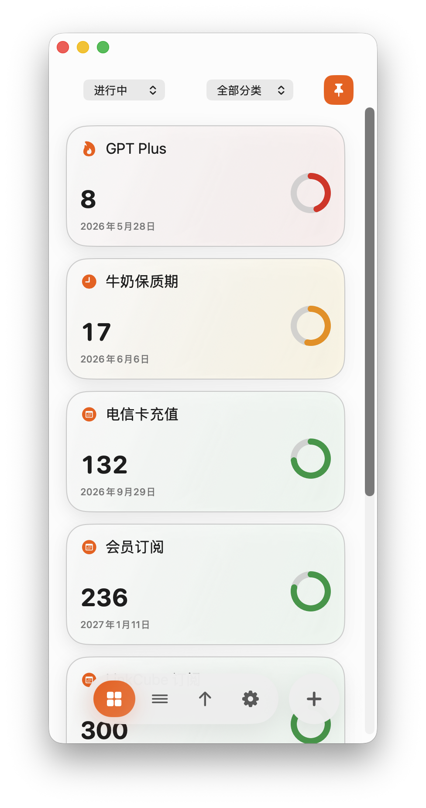
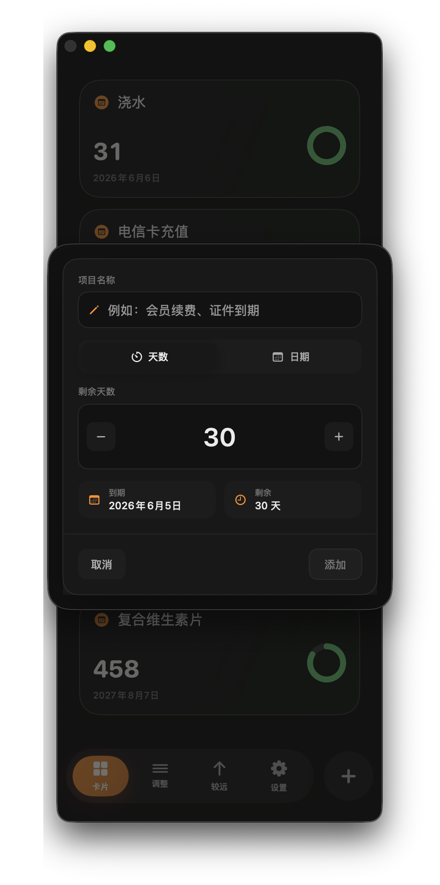

# Countdown

[English](README.en.md) | 简体中文


Countdown 是一个本地优先的 macOS SwiftUI 倒计时工具，用来追踪到期日、续费日、重复提醒和其他需要提前关注的时间节点。

当前版本：`v0.9.7`

[下载最新版本](https://github.com/WhiteBalance2800K/countdown/releases)

## 截图

<p align="center">
  
  
</p>

## 功能特性
- 测试
- [x] 追踪到期日、续费日、deadline 和周期性事项。
- [x] 新增、编辑、归档和恢复倒计时项目。
- [x] 支持直接选择到期日期，也支持按剩余天数录入。
- [x] 每个倒计时项目支持备注、分类预设和自定义分类。
- [x] 支持用快捷按钮、加减按钮或数字输入设置 Bark 提醒日期。
- [x] 支持按月、按季度、按年或自定义天数重复。
- [x] 支持一键续期周期性项目。
- [x] 支持按活跃、全部、30 天内、已过期、已归档和分类筛选。
- [x] 支持归档已完成项目，不必直接删除。
- [x] 过期项目会自动离开“进行中”，进入“已过期”视图。
- [x] 紧凑卡片布局，使用圆环和颜色表达紧迫程度。
- [x] 支持手动拖拽排序，并提供轻量调整模式。
- [x] 支持一键按临近或较远到期日排序。
- [x] 跟随 macOS 深色/浅色模式。
- [x] 支持手动选择系统、浅色或深色外观。
- [x] 支持把主窗口固定在所有窗口最上层。
- [x] 支持沉浸模式，最近三个项目直接显示名称和剩余天数，其他项目悬停查看详情。
- [x] 设置页支持 10 种语言切换，并提供 GitHub 与反馈入口。
- [x] 可选 Bark 推送提醒。
- [x] 支持菜单栏临近到期列表和快速入口。
- [x] 支持登录 macOS 后自动启动。
- [x] 支持 JSON 和 CSV 导入导出，方便备份、迁移和批量维护。
- [x] 本地优先，不需要账号，核心数据保存在本机。

## 适用场景

Countdown 适合追踪：

- 订阅续费
- 域名、证书到期
- 质保、保险期限
- 会员续费
- 个人 deadline
- 周期性提醒事项
- 任何到期前不应忘记的事项

## Roadmap / Todo

- [ ] 增加 macOS 原生通知，作为 Bark 推送之外的提醒方式。
- [ ] 增加 iCloud 同步或基于文件的可选同步，方便多台 Mac 使用。
- [ ] 增加日历导出支持，例如 `.ics` 文件。
- [ ] 增加更多看板视图，例如按分类分组视图和时间线视图。
- [ ] 增强重复规则，例如每 N 个月、指定星期几等。
- [ ] 增加批量编辑功能，用于批量修改分类、提醒天数和归档状态。
- [ ] 增加键盘快捷键，用于新增、归档、筛选和调整排序。
- [ ] 增强数据恢复工具，处理损坏或手动编辑后的数据文件。
- [ ] 增加自动化测试，覆盖数据存储、重复规则、提醒和备份恢复。

## 下载使用

从 [Releases](https://github.com/WhiteBalance2800K/countdown/releases) 页面下载最新版本。

1. 下载 `Countdown-v0.9.7-macOS.zip`。
2. 解压文件。
3. 将 `Countdown.app` 移动到“应用程序”文件夹。
4. 从 Finder 或启动台打开 Countdown。

## 环境要求

- macOS 13 或更高版本
- Swift 6.2 或更高版本，仅从源码构建时需要

## 从源码运行

```bash
swift run
```

## 构建 App

```bash
bash scripts/build_app.sh
open dist/Countdown.app
```

生成的 App 位于：

```text
dist/Countdown.app
```

Release 压缩包位于：

```text
dist/Countdown-v0.9.7-macOS.zip
```

## Bark 推送设置

1. 在 iPhone 上安装 Bark，并复制 Bark 推送地址。
2. 打开 Countdown 设置。
3. 填入类似下面的地址：

```text
https://api.day.app/your-key
```

Countdown 会自动在地址后追加通知标题和内容。

每个倒计时项目都可以单独设置 Bark 提醒日期。常用日期可以直接点选，例如到期当天、提前 1 天、提前 7 天或提前 30 天；自定义日期可以用加减按钮或数字输入设置提前天数。

## 数据存储与隐私

Countdown 会把用户数据保存在源码目录之外：

- 倒计时项目：`~/Library/Application Support/Countdown/items.json`
- 倒计时数据备份：`~/Library/Application Support/Countdown/backups/`
- UI、语言和推送偏好：通过 SwiftUI `@AppStorage` 写入 macOS `UserDefaults`
- 开机启动：通过 macOS 登录项 `SMAppService` 管理

Countdown 的核心功能不需要账号。Bark 推送是可选功能。仓库不会包含个人倒计时数据。本地备份和构建产物已通过 `.gitignore` 排除。

## 项目结构

```text
Sources/Countdown/        SwiftUI 应用源码
Resources/                App 图标和公开截图
scripts/build_app.sh      本地 .app 打包脚本
```

## 更新日志

见 [CHANGELOG.md](CHANGELOG.md)。

## 许可证

MIT。见 [LICENSE](LICENSE)。
