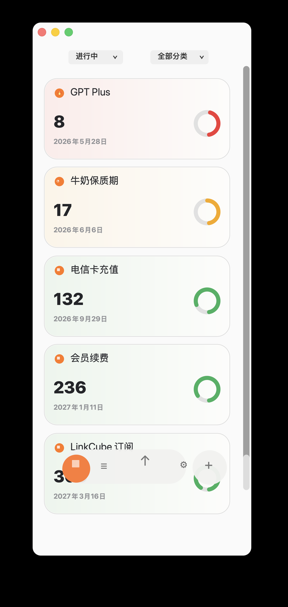

# Countdown

English | [简体中文](README.zh-CN.md)

Countdown is a small macOS SwiftUI app for tracking expiry dates, renewals, and time-sensitive items.

Current version: `v0.3`

## Screenshots

<p align="center">
  
  
</p>

## What's New In v0.3

- Split the documentation into separate English and Simplified Chinese README pages.
- Kept English as the default GitHub README.
- Adjusted the screenshots section so the two images are displayed side by side at half width.
- Updated release metadata for `v0.3`.

## What's New In v0.2

- Added a language switcher in Settings.
- Added 10 app languages: Simplified Chinese, English, Spanish, Hindi, Arabic, French, Bengali, Portuguese, Russian, and Japanese.
- Localized the main dashboard, add/edit dialog, settings dialog, date display, and Bark push text.
- Connected the selected language to native date formatting and the macOS date picker locale.
- Kept all localization preferences local through `UserDefaults`.

## Features

- Add, edit, and delete countdown items.
- Enter an expiry date directly or by remaining days.
- Compact card layout with color-coded ring progress.
- Manual drag ordering with a lightweight arrange mode.
- One-click ordering by near or far expiry dates.
- Light and dark mode support through native macOS appearance.
- Language switcher with 10 app languages.
- Optional Bark push reminders for 7 days before expiry and on the due date.
- Local-first persistence with no account or external service required for core usage.

## Persistence

Countdown keeps user data outside the source tree:

- Countdown cards: `~/Library/Application Support/Countdown/items.json`
- UI, language, and push preferences: macOS `UserDefaults` via SwiftUI `@AppStorage`

The repository does not include personal countdown data. Local backups and build outputs are excluded by `.gitignore`.

## Requirements

- macOS 13 or later
- Swift 6.2 or later

## Run From Source

```bash
swift run
```

## Build The App Bundle

```bash
bash scripts/build_app.sh
open dist/Countdown.app
```

The generated app bundle is written to `dist/Countdown.app`.

## Bark Push Setup

1. Install Bark on your iPhone and copy the Bark push URL.
2. Open Countdown settings.
3. Paste a URL like:

```text
https://api.day.app/your-key
```

Countdown appends the notification title and body automatically.

## Project Structure

```text
Sources/Countdown/        SwiftUI app source
Resources/                App icon and public screenshots
scripts/build_app.sh      Local .app bundle build script
```

## License

MIT. See [LICENSE](LICENSE).
